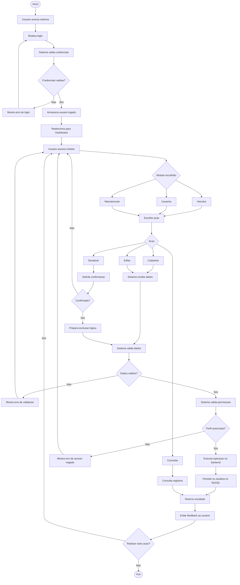

# Documentação Final — Sistema TransRota

## 1. História do Sistema

O TransRota foi desenvolvido como um sistema web para apoiar a gestão operacional de uma frota de transporte. A proposta surgiu da necessidade de centralizar informações de veículos, usuários e manutenções, substituindo controles manuais por uma aplicação organizada, rastreável e integrada.

O projeto evoluiu em etapas: primeiro foram definidas as especificações dos módulos, depois foi construído o backend em Spring Boot, em seguida foi criado um protótipo visual em HTML, CSS e JavaScript, e por fim esse protótipo foi migrado para um frontend real em React integrado ao backend.

Ao final, o sistema contempla autenticação, controle por perfil, CRUD completo dos módulos principais, exclusão lógica, documentação de API, versionamento de banco de dados e logs estruturados.

## 2. Objetivo

O objetivo do TransRota é permitir o gerenciamento básico e seguro de uma frota, oferecendo recursos para:

- controlar veículos cadastrados;
- controlar usuários do sistema;
- registrar e acompanhar manutenções;
- autenticar usuários;
- aplicar permissões por perfil;
- manter rastreabilidade técnica das operações;
- documentar a API para consulta e testes;
- versionar a estrutura do banco de dados.

## 3. Tecnologias Utilizadas

### Backend

- Java 17
- Spring Boot
- Spring Web MVC
- Spring Data JPA
- Bean Validation
- Swagger/OpenAPI com Springdoc
- Flyway
- SLF4J/Logback para logs estruturados

### Banco de Dados

- MySQL
- Tabelas versionadas por migrations Flyway
- Exclusão lógica por campo `ativo`

### Frontend

- React
- Vite
- React Router
- JavaScript
- HTML5
- CSS3

## 4. Arquitetura

O sistema segue uma arquitetura web em camadas, separando frontend, backend e banco de dados.

### 4.1 Backend

O backend está organizado nas seguintes camadas:

- **Controllers**: recebem requisições HTTP e retornam respostas da API.
- **Services**: concentram regras de negócio e coordenam operações.
- **Repositories**: realizam acesso ao banco via Spring Data JPA.
- **DTOs**: definem os dados de entrada e saída da API.
- **Entities**: representam as tabelas do banco de dados.
- **GlobalExceptionHandler**: centraliza o tratamento de erros de validação.

### 4.2 Frontend

O frontend React foi criado com base no protótipo visual aprovado. A organização segue a estrutura:

- `components`: componentes reutilizáveis, como sidebar, topbar e rota protegida;
- `layout`: layout principal autenticado;
- `pages`: telas de Login, Dashboard, Veículos, Usuários e Manutenções;
- `services`: camada de comunicação com a API;
- `routes`: configuração das rotas;
- `styles`: estilos globais baseados no protótipo.

### 4.3 Integração

O frontend consome a API REST do backend. O login é realizado por `POST /auth/login`, e as telas autenticadas usam os dados do usuário logado para refletir permissões visuais conforme o perfil.

## 5. Módulos do Sistema

### 5.1 Veículos

O módulo de veículos permite gerenciar os veículos da frota.

Funcionalidades:

- listar veículos ativos;
- cadastrar veículo;
- editar veículo;
- consultar dados do veículo;
- desativar veículo por exclusão lógica.

Campos principais:

- `id`
- `placa`
- `modelo`
- `marca`
- `ano`
- `categoria`
- `capacidadeKg`
- `status`
- `ativo`

Regras principais:

- placa obrigatória e única;
- modelo obrigatório;
- marca obrigatória;
- ano válido;
- categoria obrigatória;
- capacidade obrigatória e maior que zero;
- status obrigatório;
- exclusão lógica com `ativo = false`.

### 5.2 Usuários

O módulo de usuários permite gerenciar os usuários que acessam o sistema.

Funcionalidades:

- listar usuários ativos;
- cadastrar usuário;
- editar usuário;
- desativar usuário;
- associar usuário a um perfil.

Campos principais:

- `id`
- `nome`
- `email`
- `senha`
- `perfil`
- `ativo`

Perfis:

- `CHEFE`
- `COMERCIAL`
- `MANUTENCAO`

Regras principais:

- nome obrigatório;
- email obrigatório e único;
- senha obrigatória;
- perfil obrigatório;
- usuário precisa estar ativo para autenticar;
- exclusão lógica com `ativo = false`.

### 5.3 Manutenções

O módulo de manutenções permite registrar e acompanhar manutenções vinculadas a veículos existentes.

Funcionalidades:

- listar manutenções ativas;
- cadastrar manutenção;
- editar manutenção;
- desativar manutenção;
- consultar detalhes;
- selecionar veículo por dropdown.

Campos principais:

- `id`
- `veiculoId`
- `placaVeiculo`
- `descricao`
- `dataAbertura`
- `status`
- `observacao`
- `ativo`

Regras principais:

- manutenção deve estar vinculada a um veículo válido;
- descrição obrigatória;
- data de abertura obrigatória;
- status obrigatório;
- exclusão lógica com `ativo = false`.

## 6. Autenticação e Perfis

O sistema possui autenticação básica por email e senha. O endpoint principal é:

```text
POST /auth/login
```

Após a autenticação, o frontend armazena os dados do usuário logado e libera o acesso às rotas protegidas.

Dados retornados no login:

- `id`
- `nome`
- `email`
- `perfil`

### Perfil CHEFE

Perfil administrativo, com permissão para gerenciar veículos, usuários e manutenções.

### Perfil COMERCIAL

Perfil voltado à consulta e uso operacional, sem gerenciamento administrativo de usuários.

### Perfil MANUTENCAO

Perfil voltado ao acompanhamento e registro de manutenções.

## 7. Qualidade Técnica

### 7.1 DTOs

O sistema utiliza DTOs para separar os dados trafegados na API das entidades persistidas no banco.

Principais DTOs:

- `LoginRequestDTO`
- `LoginResponseDTO`
- `VeiculoRequestDTO`
- `VeiculoResponseDTO`
- `UsuarioRequestDTO`
- `UsuarioResponseDTO`
- `ManutencaoRequestDTO`
- `ManutencaoResponseDTO`
- `ErrorResponseDTO`

### 7.2 Validação

O backend utiliza Bean Validation nos DTOs de entrada, com anotações como:

- `@NotBlank`
- `@NotNull`
- `@Email`

Quando há erro de validação, o `GlobalExceptionHandler` retorna uma resposta padronizada.

### 7.3 Swagger/OpenAPI

A API possui documentação interativa com Swagger/OpenAPI.

Endereços:

```text
/swagger-ui.html
/v3/api-docs
```

### 7.4 Flyway

O Flyway foi adicionado para versionamento do banco de dados. As migrations ficam em:

```text
src/main/resources/db/migration
```

Migration inicial:

```text
V1__create_initial_schema.sql
```

### 7.5 Logs Estruturados

O sistema possui logs estruturados com padrão `chave=valor`, além de `correlationId` para rastrear requisições.

Exemplo:

```text
event=veiculo_created veiculoId=1 placa=ABC1D23 status=DISPONIVEL
```

## 8. Fluxo Geral do Sistema

O fluxo geral começa com o acesso do usuário ao sistema. O usuário realiza login, o backend valida as credenciais e, se forem válidas, o frontend redireciona para o dashboard. A partir do dashboard, o usuário acessa um módulo e escolhe uma ação: cadastrar, consultar, editar ou desativar.

Antes de executar operações, o sistema valida os dados informados e verifica as permissões conforme o perfil. Se houver erro, a aplicação exibe feedback ao usuário. Se a operação for válida, o backend executa a ação, persiste os dados no MySQL e retorna o resultado ao frontend.

## 9. Diagrama de Atividades



## 10. Considerações Finais

O TransRota apresenta uma solução completa para gestão básica de frota, usuários e manutenções. O sistema integra backend em Spring Boot, banco MySQL e frontend em React, mantendo coerência entre regras de negócio, interface e documentação técnica.

A aplicação contempla autenticação, controle de perfis, CRUD dos módulos principais, exclusão lógica, validações, documentação Swagger, versionamento com Flyway e logs estruturados. Dessa forma, o projeto está adequado para entrega acadêmica e preparado para evoluções futuras, como autenticação com token, testes automatizados mais amplos e relatórios operacionais.
